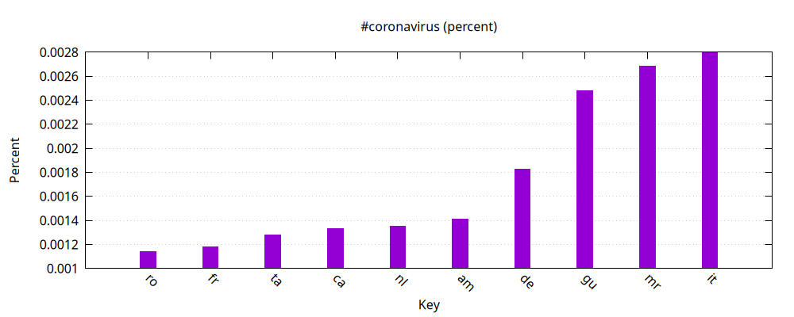
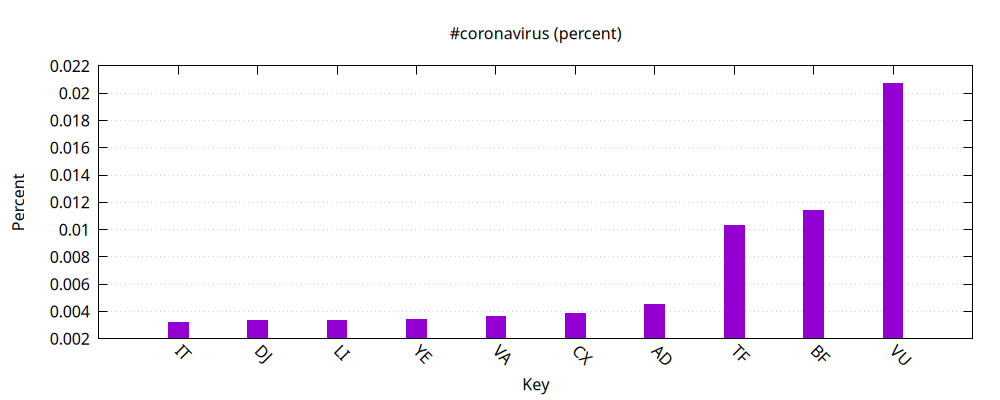
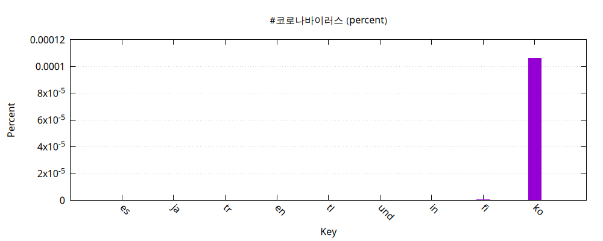
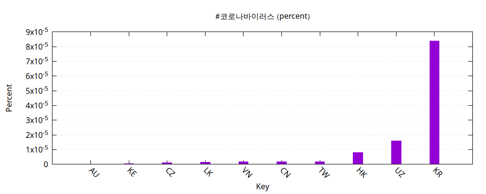
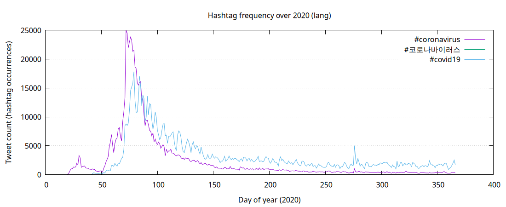

# Twitter Coronavirus MapReduce (2020)

MapReduce-style analysis of geotagged tweets from 2020. Produces hashtag frequencies by **language** and **country** and generates required plots. Note that the first two plots are not absolute counts, but rather percenatage of tweets in that language or country that contain #coronavirus. 

## Required figures (PNG)

**Language — #coronavirus**

**Country — #coronavirus**

**Language — #코로나바이러스**

**Country — #코로나바이러스**

**Line plot (alt reduce)**

## Pipeline
- `src/map.py`: for each day zip, writes `outputs/<zip>.lang` and `outputs/<zip>.country`
- `src/reduce.py`: combines all daily files into:
  - `outputs/reduced_2020.lang`
  - `outputs/reduced_2020.country`
- `src/visualize.py`: makes top-10 bar chart PNGs (percent mode supported)
- `src/alternative_reduce.py`: makes a 2020 time-series line plot for multiple hashtags
